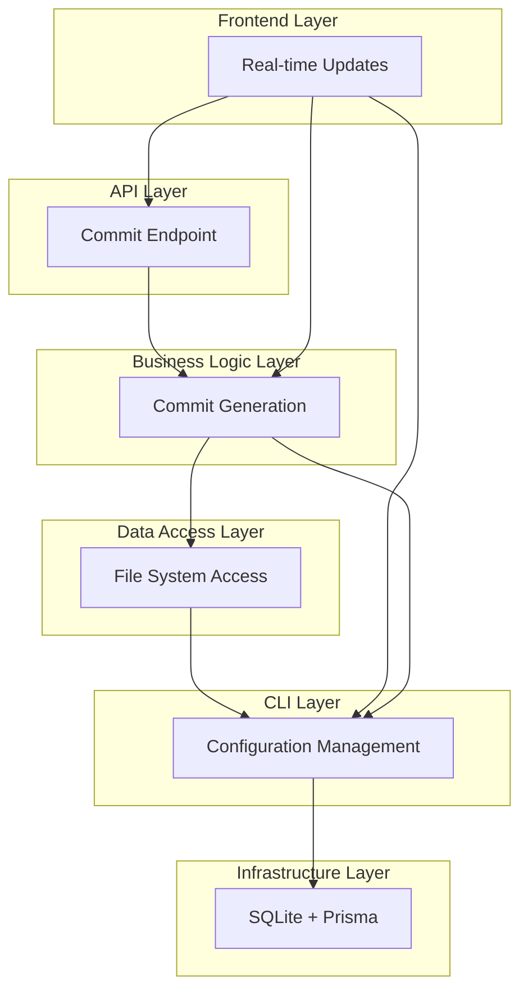
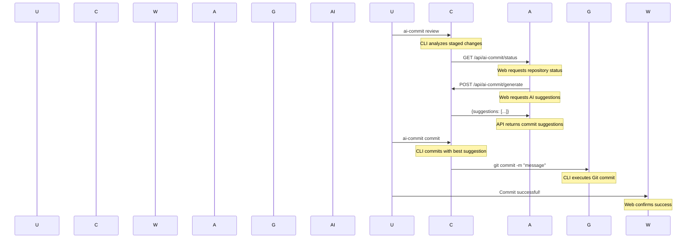

# 🏗️ Architecture Document

## System Overview

The AI Git Commit Assistant follows a **layered architecture** designed for scalability, maintainability, and extensibility:

## Component Breakdown

### Frontend Layer (Next.js 15)
- **AI Commit Dashboard** (`src/app/ai-commit/page.tsx`)
  - Repository selector with dropdown and file browser
  - Real-time status display with branch info
  - Visual diff viewer for staged changes
  - Interactive suggestion selection and commit interface
  - Recent commits history tracking
  - Multi-repository switching capability

### API Layer (Next.js Routes)
- **Status API** (`src/app/api/ai-commit/status/route.ts`)
  - Repository information and current status
  - Support for custom repository paths
  - Git branch and recent commits data

- **Generate API** (`src/app/api/ai-commit/generate/route.ts`)
  - AI-powered commit message generation
  - Configurable parameters (verbosity, temperature, tokens)
  - Multi-repository path support

- **Commit API** (`src/app/api/ai-commit/commit/route.ts`)
  - Direct Git commit execution
  - Repository-specific commit operations
  - Error handling and validation

### Business Logic Layer
- **AI Processing Service** (`src/lib/ai-assistant.ts`)
  - Local AI model management (Transformers.js)
  - Conventional commit generation
  - Context-aware analysis of code changes
  - Fallback logic for error scenarios
  - Configurable prompts and parameters

### Data Access Layer
- **Git Service** (`src/lib/git.ts`)
  - Repository detection and validation
  - Staged changes analysis
  - Commit operations (create, log, status)
  - Branch management and history
  - File system integration

### CLI Layer
- **Command Interface** (`src/cli/index.ts`)
  - Commander.js-based CLI structure
  - Subcommands: review, commit, status, config
  - Interactive mode support
  - Colored terminal output
  - Configuration file management
  - Global installation capability

### Infrastructure Layer
- **Database** (Prisma + SQLite)
  - Development database configuration
  - ORM for type-safe database operations
  - Migration and seeding support

## Data Flow Architecture

## Security Architecture

### Input Validation
- **Sanitization**: All user inputs sanitized before processing
- **Path Validation**: Prevents directory traversal attacks
- **Repository Verification**: Ensures valid Git repository before operations
- **Configuration Bounds**: Validates AI model parameters and settings

### Data Protection
- **Local Processing**: No code data transmitted to external services
- **Optional Telemetry**: Usage analytics can be disabled
- **Encrypted Storage**: Sensitive data protection in configuration files
- **Audit Logging**: Complete operation audit trail

## Technology Choices Justification

### Frontend: Next.js 15
- **App Router**: Modern routing for better UX
- **TypeScript**: Type safety for maintainability
- **Tailwind CSS**: Utility-first styling with design system
- **shadcn/ui**: Consistent component library

### Backend: Node.js API Routes
- **RESTful Design**: Standard HTTP methods for compatibility
- **JSON Responses**: Structured data for frontend consumption
- **Error Handling**: Comprehensive error management

### AI: Transformers.js
- **Local Execution**: Privacy-preserving AI processing
- **Model Flexibility**: Support for different AI models
- **Browser Compatibility**: Works in all modern environments
- **No Cloud Dependencies**: Offline capability

### Database: Prisma + SQLite
- **Type Safety**: Compile-time database validation
- **Development Ready**: Simple setup for quick start
- **Production Ready**: Robust for scale

This architecture ensures the system is **secure, maintainable, and extensible** while providing the best possible user experience across all interfaces.